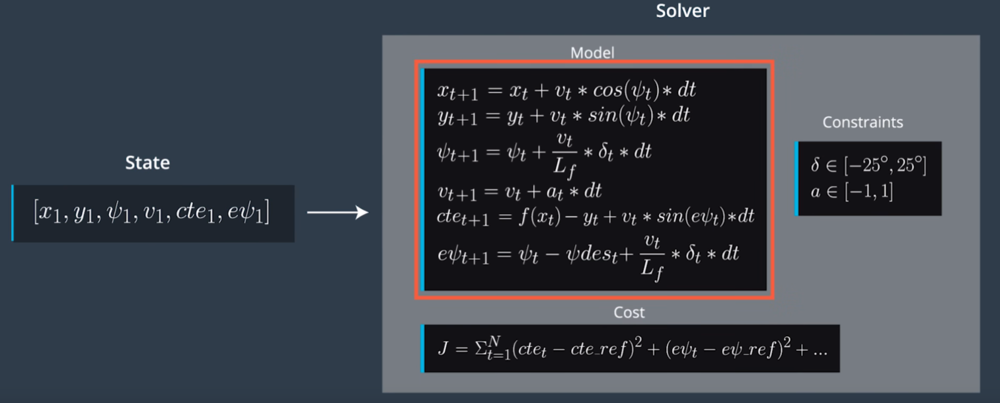

# ModelPredictiveControlSDCN

Model predictive Control project for Udacity Self Driving Car Nanodegree

### Overview

Model Predictive Control (MPC) involves simulating diffierent actuator inputs, predicting the resulting trajectory, and selecting the trajectory with minimum cost. If we know our current state and the reference trajectory we want to follow, we optimize our actuator inputs at each state in time in order to minimize the cost of our predicted trajectory. 
Once we found the trajectory with the lowest cost, we implement the first set of actuation commands. The the rest of the calculated trajectory is trown away, and instead of using that trajectory, we take our new state and calculate the new optimal trajectory. In that way, we are constantly calculating inputs over a future horizon. The reason we constantly calculate the new trajectory is because our model is only approximate, and the actual trajectory may not exactly match the predicted trajectory. So it it crucial to always re-evaluate and find the optimal actuation at every point in time. 
As shown in the following picture, MPC uses the initial state (left), the Model, the Constraints and the Cost function, and based on that it returns the vector of control inputs that minimize the given cost function. 



_The image is taken from the Udacity course material_

The cost function comprises of several components with the goal to:
- Be as close as possible to the reference state (zero cross track error, zero heading error, maintain the constant velocity)
- Minimize and smoothen control inputs such that we avoid large changes in the actuation between successive time steps
The constraints are set up such that the steering delta and the throttle delta are bounded with +/-25 degrees and +/-1 respectively.

### Description of the MPC algorithm in the _src_ directory

- In the file _main.cpp_, in the function _onMessage(...)_, the program receives the telemetry message from the simulator with the vehicle state and the actuator values: waypoints, position, heading, velocity, steering value and throttle value. 
- The first step is to __transform the simulator waypoints__ to the vehicle coordinate system. This is done to simplify the polynomial fitting because the vehicle position is now at the origin of the coordinate system of the waypoints. 
```
for (unsigned int i = 0; i < num_waypoints; i++) {
   double delta_x = ptsx[i] - px;
   double delta_y = ptsy[i] - py;
   ptsx_transformed[i] = delta_x * cos_neg_psi - delta_y * sin_neg_psi;
   ptsy_transformed[i] = delta_x * sin_neg_psi + delta_y * cos_neg_psi;
}
```
- The next step is to fit the 3rd order polynomial to the transformed waypoints
```
auto poly_coeffs = polyfit(ptsx_transformed, ptsy_transformed, 3);
```
- At this point, we can calculate the initial state and the state after 100ms, which represents the actuator delay. We use these delayed state values in the function _mpc.Solve()_ to account for that actuator delay. 
```
double x_init    = 0.0;
double y_init    = 0.0;
double psi_init  = 0.0;
double cte_init  = poly_coeffs[0];
double epsi_init = -atan(poly_coeffs[1]);

double x_after = x_init + v * cos(psi_init) * actuator_delay_s;
double y_after = y_init + v * sin(psi_init) * actuator_delay_s;
double psi_after = psi_init - v * steering_angle * actuator_delay_s / mpc.Lf;
double v_after = v + throttle * actuator_delay_s;
double cte_after = cte_init + v * sin(epsi_init) * actuator_delay_s;
double epsi_after = epsi_init - v * atan(poly_coeffs[1]) * actuator_delay_s / mpc.Lf;

// State vector with the values after the actuator delay
Eigen::VectorXd state_after(6);
state_after << x_after, y_after, psi_after, v_after, cte_after, epsi_after;

// Calculate the MPC solution
auto vars = mpc.Solve(state_after, poly_coeffs);
```
- The function _mpc.Solve()_ returns the vector of actuation values, so we can now extract those and add them to the JSON message that we send back to the simulator. The simulator applies these values and thus closes one iteration in the loop. The next iteration starts with the simulator sending the next telemetry message to the program, which will trigger re-computation of the code above (transform waypoints, polyfit, solve)
```
double steer_value = vars[0];
double throttle_value = vars[1];
json msgJson;
// Divide by deg2rad(25) before you send the steering value back.
// Otherwise the values will be in between [-deg2rad(25), deg2rad(25] instead of [-1, 1].
msgJson["steering_angle"] = steer_value / deg2rad(25);
msgJson["throttle"] = throttle_value;
```
- Note that the JSON message sent back from the program to the simulator also contains the MPC predicted trajectory (displayed with green color in the simulator), and the reference line based on the polynomial fit (yellow line in the simulator). These are used strictly for visualization, i.e. sanity checking that our MPC algorithm produces reasonable results. 

##### The content of _MPC.cpp_

In the file _MPC.cpp_ there are two main code blocks: one to define the *FG_eval* class, and one to define the _Solve()_ function. Apart from that, in this file we also **define the number of timestemps and the duration of one timestep**. In this case, the values are 10 and 100ms, respectively, which are obtained by experimenting a bit with the values, but keeping the product of N and dT at a constant (to always be 1 second).    
- The Solve() function takes the vehicle's state and the fitted polynomial to the waypoints, defines the cost function and the vectors of variables and the constraints, and computes the actuation inputs that minimize the cost function (taking the constraints into account). 
- The number of variables in the model is 46, as given with the following equation (NOTE: the state vector has 6 elements, namely *x, y, psi, v, cte, and epsi*):
```
size_t n_vars = 6 * N + 2 * (N - 1);
```
- Similarly, the number of contraints is equal to 120: there are 10 timestamps and 6 values in the state vector, and we need to constrain 2 bounds (upper and lower). Hence, the number of constraints equals 10x6x2 = 120. 
- The variables need to have their bounds specified for the model. Essentially, only _delta_ and _a_ are bounded, by +/-25 degrees and +/-1, respectively. All other variables are unbounded (i.e. their bounds are set to a very large number, +/-1.0e19)
- The lower and upper bounds of the constraints are set to zero for all the states, apart from the initial state, where the bounds are set to the actual initial state values. 
- After setting up the variables, the variables bounds and the constraints bounds, we can call the function _solve()_ to obtain the solution, and then from the solution we simply extract the values for _delta_ and _a_ for the first step and return that to the main program. These values are used as actuation values sent back to the simulator. We also extract _x_ and _y_ for all the timesteps, and these values are essentially the MPC predicted trajectory that is sent back to the simulator from the main program and displayed in the simulator as the green line.  
```
CppAD::ipopt::solve<Dvector, FG_eval>(
      options, vars, vars_lowerbound, vars_upperbound, constraints_lowerbound,
      constraints_upperbound, fg_eval, solution);
...
vector<double> result;
result.push_back(solution.x[delta_start]);
result.push_back(solution.x[a_start]);
for (unsigned int i = 0; i < N - 2; i++ ) {
   result.push_back(solution.x[x_start + i + 1]);
   result.push_back(solution.x[y_start + i + 1]);
}
return result;
```

##### The cost function
As stated above, the cost function is defined to keep the vehicle to the reference position as close as possible, and to make sure that the actuation is reasonable, i.e. that we get smooth operation of the vehicle by the actuator. The reference position essentially means that the CTE error and the heading error are equal to zero, and that the vehicle maintains the constant velocity when going around the tracks. 
```
const double ref_cte  = 0;
const double ref_epsi = 0;
const double ref_v    = 100;
```
Different cost function components can be weighted with different factors, and these factors can be obtained experimentally. The entire cost function can be defined with the following piece of code in _MPC.cpp_:
```
fg[0] = 0;
// Add the cost associated with the deviation to the reference state
for (unsigned int i = 0; i < N; i++) {
  fg[0] += cost_factor_ref_state * CppAD::pow(vars[cte_start + i] - ref_cte, 2);
  fg[0] += cost_factor_ref_state * CppAD::pow(vars[epsi_start + i] - ref_epsi, 2);
  fg[0] += CppAD::pow(vars[v_start + i] - ref_v, 2);
}
// Add the cost associated with the actuator values
for (unsigned int i = 0; i < N - 1; i++) {
  fg[0] += cost_factor_actuator * CppAD::pow(vars[delta_start + i], 2);
  fg[0] += cost_factor_actuator * CppAD::pow(vars[a_start + i], 2);
}
// Add the cost associated with the actuator deltas
for (unsigned int i = 0; i < N - 2; i++) {
  fg[0] += cost_factor_smooth_delta * CppAD::pow(vars[delta_start + i + 1] - vars[delta_start + i], 2);
  fg[0] += cost_factor_smooth_a * CppAD::pow(vars[a_start + i + 1] - vars[a_start + i], 2);
}
```
Here, the weighting factors are defines as:
```
// Factors for cost scaling
int cost_factor_ref_state    = 1000;
int cost_factor_actuator     = 50;
int cost_factor_smooth_delta = 250000;
int cost_factor_smooth_a     = 5000;
```

### Setting up the environment 
- The project is configured to compile with cmake and make. Please make sure that the following dependencies are met:
   - cmake version 3.5
   - make version 4.1 for Linux and Mac and 3.81 for Windows
   - gcc/g++ version 5.4
- Download the Udacity simulator from [here](https://github.com/udacity/self-driving-car-sim/releases/)
- Additional libraries need to be installed by running:
   - On Ubuntu, install-ubuntu.sh 
   - On Mac, install-mac.sh
   - On Windows, the recommended way is to run a virtual machine and use the install-ubuntu.sh script
- The project also uses libraries Ipopt, CppAD, and Eigen 
   - **Ipopt and CppAD:** Please refer to [this document](https://github.com/udacity/CarND-MPC-Project/blob/master/install_Ipopt_CppAD.md) for installation instructions.
   - [Eigen](http://eigen.tuxfamily.org/index.php?title=Main_Page). This is already part of the repo so you shouldn't have to worry about it.
   
### More information
For even more information on the project structure, dependencies etc. please check original Udacity project [repository](https://github.com/udacity/CarND-MPC-Project)
